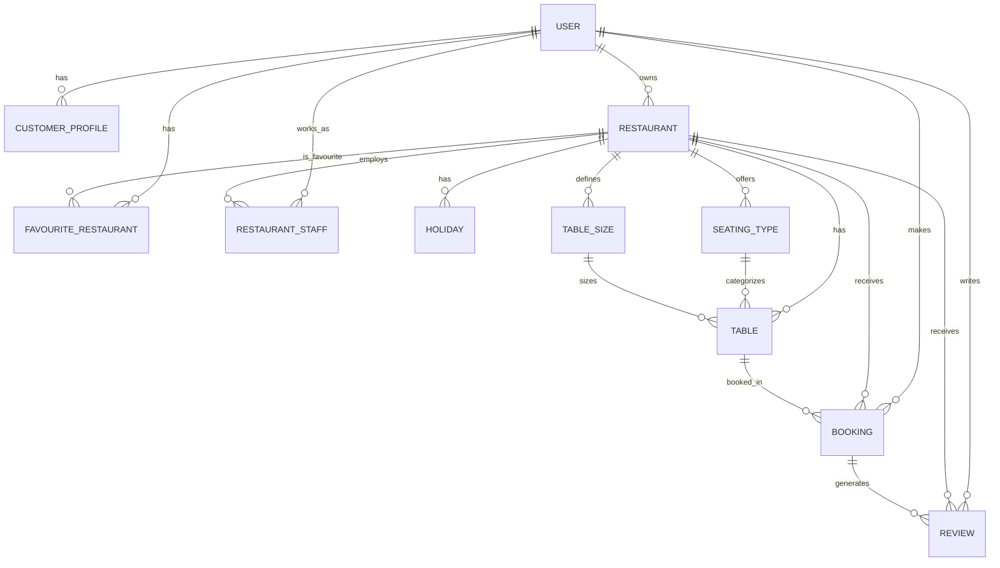

# DineSphere - Entity Relationship Model

## Complete Database Schema



---

## Entity Definitions

### 1. USER (usershandling_user)
**Purpose:** Central authentication and user management

| Field | Type | Constraints | Description |
|-------|------|-------------|-------------|
| id | INTEGER | PK, Auto | Unique identifier |
| password | VARCHAR(128) | NOT NULL | Django hashed password |
| last_login | DATETIME | NULL | Last authentication |
| is_superuser | BOOLEAN | DEFAULT FALSE | Admin access |
| username | VARCHAR(150) | UNIQUE, NOT NULL | Login identifier |
| first_name | VARCHAR(150) | NULL | User first name |
| last_name | VARCHAR(150) | NULL | User last name |
| email | VARCHAR(254) | NULL | Contact email |
| is_staff | BOOLEAN | DEFAULT FALSE | Django staff status |
| is_active | BOOLEAN | DEFAULT TRUE | Account active status |
| date_joined | DATETIME | DEFAULT CURRENT_TIMESTAMP | Registration date |
| image | VARCHAR(100) | NULL | Profile picture path |
| date_of_birth | DATE | NULL | Birth date |
| gender | VARCHAR(10) | NULL | Gender identification |
| is_owner | BOOLEAN | DEFAULT FALSE | Restaurant owner flag |
| phone | VARCHAR(20) | NULL | Contact number |

**Relationships:**
- 1:1 with CUSTOMER_PROFILE (extends user data)
- 1:N with RESTAURANT (owns)
- N:M with RESTAURANT (through RESTAURANT_STAFF)
- 1:N with BOOKING (makes reservations)
- 1:N with REVIEW (writes)
- 1:N with FAVOURITE_RESTAURANT

---

### 2. CUSTOMER_PROFILE (usershandling_customerprofile)
**Purpose:** Extended customer-specific data

| Field | Type | Constraints | Description |
|-------|------|-------------|-------------|
| id | INTEGER | PK, Auto | Unique identifier |
| user_id | INTEGER | FK, UNIQUE, NOT NULL | Links to USER |
| preferences | TEXT | NULL | JSON dietary preferences |
| total_bookings | INTEGER | DEFAULT 0 | Booking history count |
| total_spent | DECIMAL(10,2) | DEFAULT 0.00 | Lifetime spend |

**Note:** One-to-one extension of USER for customers only

---

### 3. RESTAURANT (restaurants_restaurant)
**Purpose:** Restaurant business entity

| Field | Type | Constraints | Description |
|-------|------|-------------|-------------|
| id | INTEGER | PK, Auto | Unique identifier |
| name | VARCHAR(100) | NOT NULL | Business name |
| description | TEXT | NULL | Business description |
| location | VARCHAR(200) | NULL | Street address |
| city | VARCHAR(50) | NULL | City for search |
| phone | VARCHAR(20) | NULL | Contact phone |
| email | VARCHAR(254) | NULL | Contact email |
| image | VARCHAR(100) | NULL | Cover photo path |
| opening_time | TIME | NULL | Daily opening |
| closing_time | TIME | NULL | Daily closing |
| owner_id | INTEGER | FK | Links to USER (owner) |
| is_approved | BOOLEAN | DEFAULT FALSE | Admin approval status |
| created_at | TIMESTAMP | DEFAULT CURRENT_TIMESTAMP | Registration date |
| updated_at | TIMESTAMP | NULL | Last modification |

**Business Rules:**
- Must be approved (is_approved=TRUE) to appear in search
- Owner must have is_owner=TRUE in USER
- Opening/closing times are daily defaults (holidays override)

---

### 4. TABLE (restaurants_table)
**Purpose:** Physical dining tables

| Field | Type | Constraints | Description |
|-------|------|-------------|-------------|
| id | INTEGER | PK, Auto | Unique identifier |
| restaurant_id | INTEGER | FK, NOT NULL | Parent restaurant |
| table_number | VARCHAR(10) | NOT NULL | Display identifier |
| capacity | INTEGER | NOT NULL | Max seats |
| seating_type_id | INTEGER | FK | Indoor/outdoor/patio |
| size_category_id | INTEGER | FK | Small/medium/large |
| is_active | BOOLEAN | DEFAULT TRUE | Available for booking |

**Unique Constraint:** (restaurant_id, table_number) - table numbers unique per restaurant

---

### 5. SEATING_TYPE (restaurants_seatingtype)
**Purpose:** Categorize table locations

| Field | Type | Constraints | Description |
|-------|------|-------------|-------------|
| id | INTEGER | PK, Auto | Unique identifier |
| restaurant_id | INTEGER | FK | Owner restaurant |
| name | VARCHAR(50) | NOT NULL | "Indoor", "Patio", etc. |
| description | VARCHAR(200) | NULL | Details |

---

### 6. TABLE_SIZE (restaurants_tablesize)
**Purpose:** Capacity-based categorization

| Field | Type | Constraints | Description |
|-------|------|-------------|-------------|
| id | INTEGER | PK, Auto | Unique identifier |
| restaurant_id | INTEGER | FK | Owner restaurant |
| name | VARCHAR(50) | NOT NULL | "Small", "Medium", "Large" |
| min_capacity | INTEGER | NULL | Minimum seats |
| max_capacity | INTEGER | NULL | Maximum seats |

---

### 7. RESTAURANT_STAFF (restaurants_restaurantstaff)
**Purpose:** Link users to restaurants with roles

| Field | Type | Constraints | Description |
|-------|------|-------------|-------------|
| id | INTEGER | PK, Auto | Unique identifier |
| user_id | INTEGER | FK, NOT NULL | Staff member |
| restaurant_id | INTEGER | FK, NOT NULL | Employer |
| role | VARCHAR(20) | DEFAULT 'staff' | Position |
| is_admin | BOOLEAN | DEFAULT FALSE | Management access |
| joined_at | TIMESTAMP | DEFAULT CURRENT_TIMESTAMP | Employment start |

**Role Values:** 'owner', 'manager', 'host', 'waiter', 'chef', 'staff'

**Unique Constraint:** (user_id, restaurant_id) - one role per user per restaurant

---

### 8. BOOKING (reservations_booking)
**Purpose:** Restaurant reservation records

| Field | Type | Constraints | Description |
|-------|------|-------------|-------------|
| id | INTEGER | PK, Auto | Unique identifier |
| restaurant_id | INTEGER | FK, NOT NULL | Venue |
| user_id | INTEGER | FK, NOT NULL | Customer |
| table_id | INTEGER | FK | Assigned table |
| booking_start | DATETIME | NOT NULL | Reservation start |
| booking_end | DATETIME | NOT NULL | Reservation end |
| status | VARCHAR(20) | DEFAULT 'pending' | Booking state |
| payment_status | VARCHAR(20) | DEFAULT 'pending' | Payment state |
| total_price | DECIMAL(10,2) | DEFAULT 0.00 | Amount charged |
| guest_count | INTEGER | NULL | Number of diners |
| special_requests | TEXT | NULL | Customer notes |
| created_at | TIMESTAMP | DEFAULT CURRENT_TIMESTAMP | Booking made |
| updated_at | TIMESTAMP | NULL | Last update |

**Status Values:**
- `pending` - Awaiting confirmation/payment
- `confirmed` - Payment received, table reserved
- `cancelled` - Booking voided
- `completed` - Dining finished

**Payment Status Values:**
- `pending` - Not paid
- `paid` - Payment received
- `refunded` - Refund issued

---

### 9. REVIEW (reservations_review)
**Purpose:** Customer feedback

| Field | Type | Constraints | Description |
|-------|------|-------------|-------------|
| id | INTEGER | PK, Auto | Unique identifier |
| restaurant_id | INTEGER | FK, NOT NULL | Reviewed venue |
| user_id | INTEGER | FK, NOT NULL | Reviewer |
| booking_id | INTEGER | FK | Related visit |
| rating | INTEGER | CHECK(1-5) | Star rating |
| comment | TEXT | NULL | Written review |
| created_at | TIMESTAMP | DEFAULT CURRENT_TIMESTAMP | Posted date |

**Business Rule:** Should verify booking_id shows completed visit

---

### 10. HOLIDAY (restaurants_holiday)
**Purpose:** Special closure dates

| Field | Type | Constraints | Description |
|-------|------|-------------|-------------|
| id | INTEGER | PK, Auto | Unique identifier |
| restaurant_id | INTEGER | FK, NOT NULL | Affected venue |
| name | VARCHAR(100) | NOT NULL | "Christmas", etc. |
| date | DATE | NOT NULL | Closure date |
| is_closed | BOOLEAN | DEFAULT TRUE | Full day closure |
| special_opening | TIME | NULL | Modified hours (if not closed) |
| special_closing | TIME | NULL | Modified hours (if not closed) |

---

### 11. FAVOURITE_RESTAURANT (restaurants_favouriterestaurant)
**Purpose:** Customer saved restaurants

| Field | Type | Constraints | Description |
|-------|------|-------------|-------------|
| id | INTEGER | PK, Auto | Unique identifier |
| user_id | INTEGER | FK, NOT NULL | Customer |
| restaurant_id | INTEGER | FK, NOT NULL | Saved venue |
| created_at | TIMESTAMP | DEFAULT CURRENT_TIMESTAMP | When saved |

**Unique Constraint:** (user_id, restaurant_id) - can't favourite twice

---

## Relationship Summary

```
USER (1) ---- (1) CUSTOMER_PROFILE
    |
    | (1:N)
    v
RESTAURANT (1) ---- (1) USER (as owner)
    |
    | (1:N)
    |---- TABLE (N:M via SEATING_TYPE, TABLE_SIZE)
    |
    | (1:N)
    |---- RESTAURANT_STAFF (N:M to USER)
    |
    | (1:N)
    |---- HOLIDAY
    |
    | (1:N)
    |---- BOOKING (N:M to USER, 1:N to TABLE)
    |
    | (1:N)
    |---- REVIEW (N:M to USER, 1:1 to BOOKING)
    |
    | (1:N)
    |---- FAVOURITE_RESTAURANT (N:M to USER)
```

---

## Indexes for Performance

```sql
-- Search optimization
CREATE INDEX idx_restaurant_search ON restaurants_restaurant(city, is_approved);
CREATE INDEX idx_restaurant_name ON restaurants_restaurant(name);

-- Booking queries (most frequent)
CREATE INDEX idx_booking_date ON reservations_booking(booking_start, booking_end);
CREATE INDEX idx_booking_restaurant ON reservations_booking(restaurant_id, status);
CREATE INDEX idx_booking_user ON reservations_booking(user_id, status);

-- Availability checking
CREATE INDEX idx_booking_overlap ON reservations_booking(restaurant_id, table_id, booking_start, booking_end);

-- Review aggregation
CREATE INDEX idx_review_restaurant ON reservations_review(restaurant_id);
CREATE INDEX idx_review_user ON reservations_review(user_id);

-- Staff lookups
CREATE INDEX idx_staff_lookup ON restaurants_restaurantstaff(user_id, restaurant_id);

-- Favourite checking
CREATE INDEX idx_favourite_lookup ON restaurants_favouriterestaurant(user_id, restaurant_id);
```

---

## Data Integrity Rules

1. **Restaurant Approval:** Only `is_approved=TRUE` restaurants appear in customer search
2. **Booking Overlap:** No two bookings can overlap for same table: `(table_id, booking_start, booking_end)` must not intersect
3. **Review Verification:** Review should only be postable for `booking.status='completed'`
4. **Staff Access:** Staff can only access their assigned restaurant's data
5. **Owner Uniqueness:** One owner per restaurant, but owner can have multiple restaurants
6. **Holiday Enforcement:** No bookings allowed on `is_closed=TRUE` holidays

---

## Query Examples

**Find available tables for time slot:**
```sql
SELECT t.* 
FROM restaurants_table t
WHERE t.restaurant_id = ?
  AND t.is_active = TRUE
  AND t.id NOT IN (
    SELECT b.table_id 
    FROM reservations_booking b
    WHERE b.status IN ('confirmed', 'pending')
      AND b.booking_start < ?  -- requested end
      AND b.booking_end > ?    -- requested start
  );
```

**Get restaurant with average rating:**
```sql
SELECT r.*, AVG(rev.rating) as avg_rating, COUNT(rev.id) as review_count
FROM restaurants_restaurant r
LEFT JOIN reservations_review rev ON rev.restaurant_id = r.id
WHERE r.id = ?
GROUP BY r.id;
```

**Find upcoming bookings for owner:**
```sql
SELECT b.*, u.username, u.email, t.table_number
FROM reservations_booking b
JOIN restaurants_restaurant r ON r.id = b.restaurant_id
JOIN usershandling_user u ON u.id = b.user_id
LEFT JOIN restaurants_table t ON t.id = b.table_id
WHERE r.owner_id = ?
  AND b.booking_start > NOW()
  AND b.status = 'confirmed'
ORDER BY b.booking_start;
```
